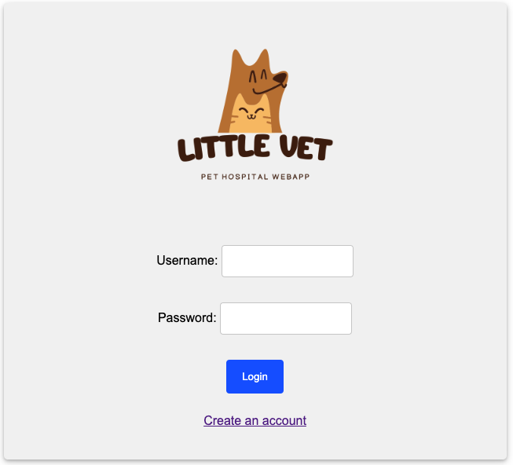
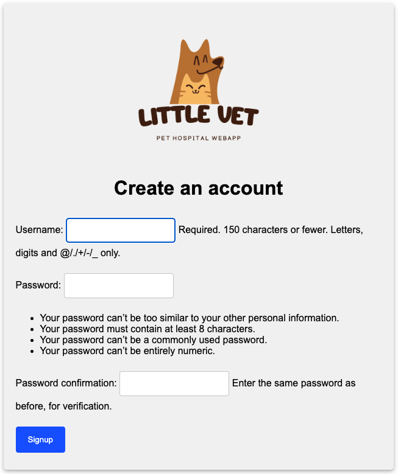
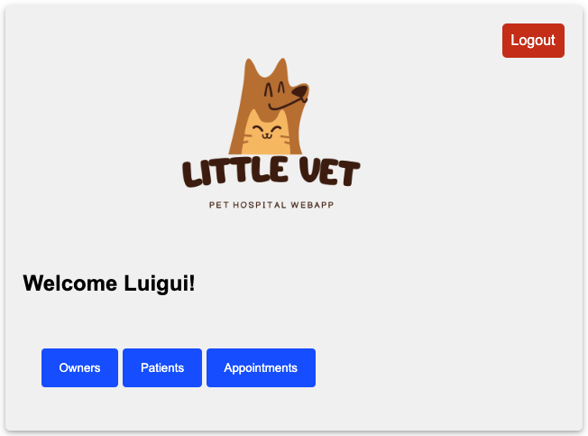
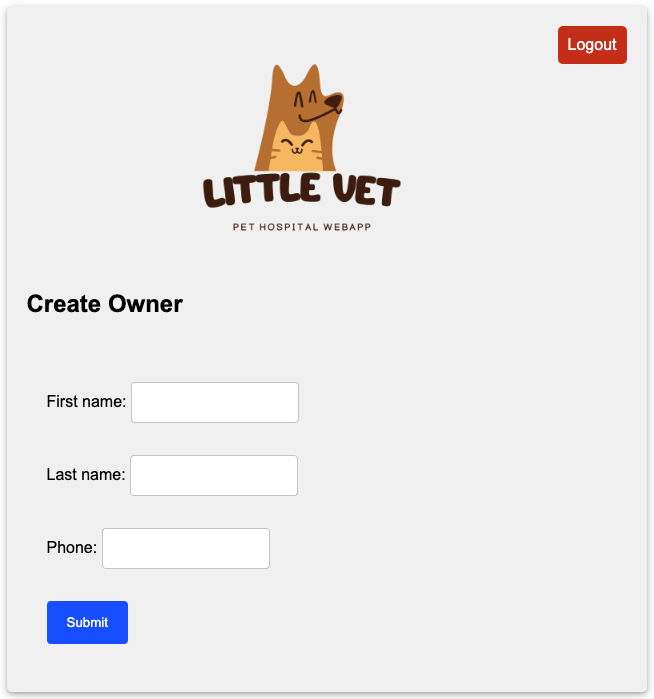
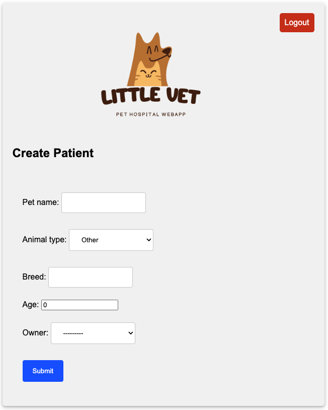
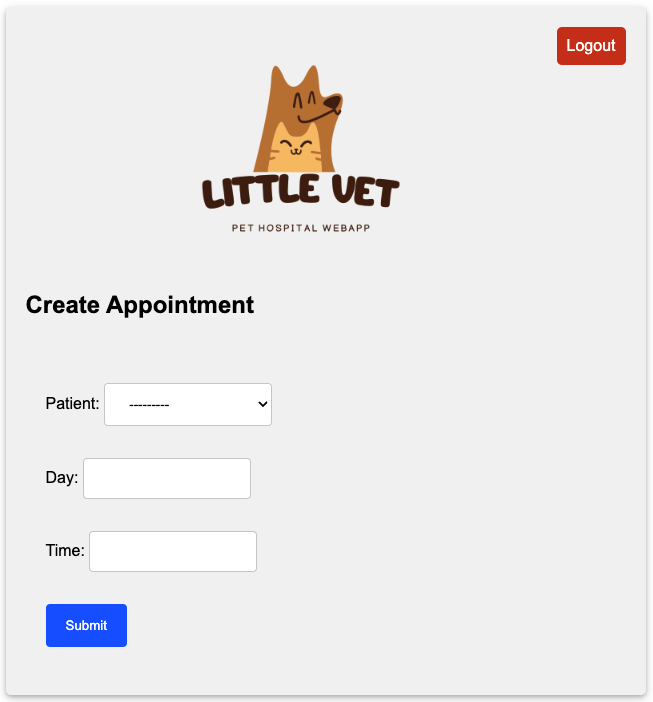

# LittleVet Django web app
I created this Django web app to have a database for a little pet hospital. With this web app you can administrate **Owners**, **Patients** (Pets) and **Appointments**.

1. This is the login page. You can Logint or Create an account:

2. Create a new user:

3. Inside the app, you can check the  **Owners**, **Patients** and **Appointments**

4. Create a new **Owner**

5. Create a new **Patient**

6. Create a new **Appointment**

